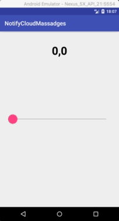
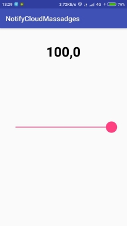
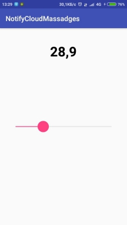
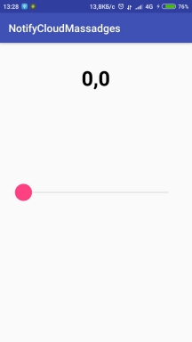

# Example Flout value in Android SeecBar


-------

|  |  |  | |
| :-: | :-: | :-: | :-: |
|||| |

-------
## How to use
### marking in xml:
```xml
<TextView
        android:id="@+id/msg"
        android:layout_marginTop="40dp"
        android:layout_width="wrap_content"
        android:layout_height="wrap_content"
        android:singleLine="false"
        android:lines="4"
        android:text="0.0"
        android:textSize="38sp"
        android:textStyle="bold"
        android:textColor="@android:color/black"
        android:textAlignment="center"
        android:layout_marginStart="16dp"
        android:layout_marginEnd="16dp"
        android:layout_alignParentTop="true"
        android:layout_centerHorizontal="true"/>
```

### Code to use

```java
protected void onCreate(Bundle savedInstanceState) {
        super.onCreate(savedInstanceState);
        setContentView(R.layout.activity_main);

        TextView txt = findViewById(R.id.msg);
        FloatSeekBar seek = findViewById(R.id.cosSeeck);

        seek.setOnFloatSeekBarChangeListener(new FloatSeekBar.OnFloatSeekBarChangeListener() {
            @Override
            public void onFloatSeekProgressChanged(SeekBar seekBar, float i, boolean b) {
                txt.setText(String.format("%.1f", i));

            }

            @Override
            public void onStartTrackingTouch(SeekBar seekBar) {

            }

            @Override
            public void onStopTrackingTouch(SeekBar seekBar) {
            }
        });


    }
```
### attr.xml
```xml
<?xml version="1.0" encoding="utf-8"?>
<resources>

    <declare-styleable name="FloatSeekBar">
        <attr name="floatMax" format="float" />
        <attr name="floatMin" format="float" />
        <attr name="progress" format="float"/>
    </declare-styleable>

</resources>
```
### FloatSeekBar class

```java
public class FloatSeekBar extends android.support.v7.widget.AppCompatSeekBar
        implements SeekBar.OnSeekBarChangeListener  {
    private OnFloatSeekBarChangeListener floatListener;
    private float floatMaxValue = 100.f;
    private float floatProgress = 0.f;
    private float minProgress = 0.f;

    public float getMinProgress() {
        return minProgress;
    }

    public void setMin(float minProgress) {
        this.minProgress = minProgress;
        int middle = getMiddle(floatMaxValue, minProgress);
        super.setMax(middle);


    }

    private int getMiddle(float floatMaxValue, float minPrgress) {
        float v = floatMaxValue - minPrgress;
        int round = Math.round(v * 10);
        return round;
    }


    public float getFloatProgress() {
        return floatProgress;
    }

    public void setFloatProgress(float floatProgress) {
        this.floatProgress = floatProgress;
        int i = Math.round((floatProgress - minProgress) * 10);
        super.setProgress(i);

    }


    public FloatSeekBar(Context context) {
        super(context);
        this.setOnSeekBarChangeListener(this);

    }


    public FloatSeekBar(Context context, AttributeSet attrs) {
        super(context, attrs);
        TypedArray typedArray = context.getTheme().obtainStyledAttributes(attrs, R.styleable.FloatSeekBar, 0, 0);

        floatMaxValue = typedArray.getFloat(R.styleable.FloatSeekBar_floatMax, 100f);
        minProgress = typedArray.getFloat(R.styleable.FloatSeekBar_floatMin, 0f);
        floatProgress = typedArray.getFloat(R.styleable.FloatSeekBar_progress, 0f);

        setFloatProgress(floatProgress);
        this.setOnSeekBarChangeListener(this);
    }

    public float getMaxProgress() {
        return floatMaxValue;
    }

    public void setMax(float value) {
        floatMaxValue = value;
        int middle = getMiddle(floatMaxValue, minProgress);
        super.setMax(middle);

    }


    public void setOnFloatSeekBarChangeListener(OnFloatSeekBarChangeListener floatListener) {
        this.floatListener = floatListener;
        int middle = getMiddle(floatMaxValue, minProgress);
        super.setMax(middle);


    }

    @Override
    public void onProgressChanged(SeekBar seekBar, int i, boolean b) {
        floatProgress = minProgress + i / 10.0f;
        floatListener.onFloatSeekProgressChanged(seekBar, floatProgress, b);

    }

    @Override
    public void onStartTrackingTouch(SeekBar seekBar) {
        floatListener.onStartTrackingTouch(seekBar);

    }

    @Override
    public void onStopTrackingTouch(SeekBar seekBar) {
        floatListener.onStopTrackingTouch(seekBar);
    }

    public static interface OnFloatSeekBarChangeListener {
        public void onFloatSeekProgressChanged(SeekBar seekBar, float i, boolean b);
        public void onStartTrackingTouch(SeekBar seekBar);
        public void onStopTrackingTouch(SeekBar seekBar);
    }

    @Override
    protected synchronized void onDraw(Canvas canvas) {
        super.onDraw(canvas);

    }
}
```


